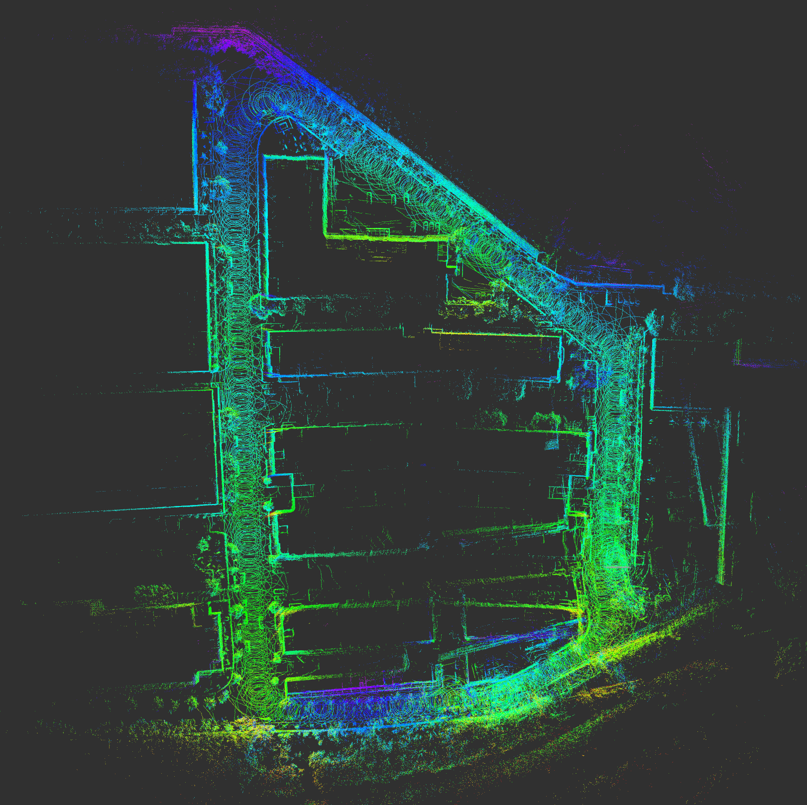

# 1.Introduction

This program use ROS and it is divided into 2 different part. The 1st part is to get the g2o file from the Lidar odometry and get the loop closure data from orb. 

The second part is to get the loop closure information and calculate the transform by NDT(normal distribution transform) to get the accurate loop closure information to the first part.


# 2. Dependences && make

The ROS requirement is Kinetic and it depends on **Eigen 3 PCL 1.5+ Cholmod G2O**

Here is how to run it :

> cd catkin_ws
>
> catkin_make
>
> rosrun g2oodomsave g2oSaver
>
> rosrun g2oodomsave ndtCalc

# 3.New Code(Tools)

I added a new tools to switch the coordinate of LOAM to the rslidar coordinate, and this program is called OdomTransfer. It subscribe the odom and point topic to fix the odom problem.

It will publish the point and odom after transform.

# 4. The function of code

### 1. g2osaver.cpp

The main function is to get the odom and the loop closure edge of the LOAM and ORB.

```c++
subscribe<nav_msgs::Odometry>("/after_rotate",1000, &G2oSaver::lidarOdomHandler,this);
subscribe<nav_msgs::Odometry>("/ndt_loop_tf",1000, &G2oSaver::ndtTrans,this);
```

​	This read the topic named `/ndt_loop_tf`  from **ndtTransCalc** and the message type is  *nav_msgs::Odometry* . 

​	It also read the `after_rotate` from **Odomtransfer** to get the correct odometry.

​	We assume the **loopClosure->twist.covariance.elems[0] ** as the information which tells this odom message is previous (set it as 1) or this is the current frame(set as 0). 

​	We also assume the **loopClosure->twist.covariance.elems[1]** as the loop closure ID of the Key Frame. For example we find the loop closure at frame 40 and 104, we set the `loopClosure->twist.covariance.elems[1]` equals 40 as the previous frame and 104 for the current frame. 

​	The transform is the result after NDT, need to be deal with later. Seen in 2.

### 2. The calculation of TF

​	Here are the steps that how to calculate two steps:

##### condition 1. Use the *transform and rotation* from *Lidar Mapping*:

> 1. Calculate the origin position of two cloud according to the Lidar Odometry.
> 2. Calculate the relative transform between two frame( this is for relative transform in a map, we can regard it as the registering for the wall and trees).
> 3. This transform in step 2 is the loop closure edge's transform. 

$$
T^{edge} = (T^{last})^{-1} * T^{curr}*T^{NDT}
$$


##### condition 2. Use the down sampled *transform and the rotation* from *Lidar odometry*.

> 1. Because of the point cloud and the odometry is different with the Lidar Mapping, we can not get the point by odometry but we just need to rotation of the point cloud and save it.
> 2. Calculate the relative transform between two frame( this is for relative transform in a map, we can regard it as the registering for the wall and trees).
> 3. This transform in step 2 is the loop closure edge's transform. 

​     `loopClosure->header.stamp.nsec` and `loopClosure->header.stamp.sec` are the time stamp of these two frame. 

- [x] Later we may calculate the **real** transform from here with the odom.
- [ ] Air pressure interface to be finished.
- [x] Bug fixed : without initial vertex
- [x] Use the 1HZ odom for demo.

## 2. LMoptimize.cpp

​	This part is currently being changing, and it may change into the Ceres library in the future

```c++
subscribe<std_msgs::Bool>("/g2o_finish",1000, &LMoptimizer::lmStart,this);
advertise<std_msgs::Bool>("/mapping",5);
```

​	When it get true from Ros message from **g2oSaver** it will run a optimize int the relative .g2o file.

​	It will also advertise `mapping` to the **mapping ** node to formulate the point cloud map.

- [x] Finish.

## 3. ndtTransCalc.cpp

### 1. Introduction

​	The mainly goal is to get two point cloud and calculate the trans between two frame and give the transform between two robot pose.  Here are the test that **without a correct initial pose** of two point cloud, and these two point clouds' transform is given by the LOAM.


​

### 2. Input

​	This program have 3 topics to subscribe from **PCDFinder**. 

```c++
subscribe<nav_msgs::Odometry>("/loop_coarse_tf",2, &ndtcalc::picNumHandler, this);
subscribe<sensor_msgs::PointCloud2>("/ndt_points_past",2, &ndtcalc::pointCloudHandler, this);
subscribe<sensor_msgs::PointCloud2>("/ndt_points_cur",2, &ndtcalc::pointCloudHandler, this);
```


>1. `/loop_coarse_tf` is the relative transform which is from the previous frame to current frame. This also tells the **number** connected with two Vertex form **find PCD node** 
>2. `/ndt_points_past` is the previous loop point cloud form **find PCD node** .
>3. `/ndt_points_cur` is the current loop closure point cloud form **find PCD node** .

- [x] Odom transfer not solved
- [x] Ros connector finish
- [ ] Test the whether the TF is correct
- [x] Current it will read two test PCD, later remove it.

## 4. Odomtransfer.cpp

​	This program transform the odom and the point cloud form the LOAM, there are 4 publishers `after_rotate` `pc_after_rotate`  `after_rotate_01hz` `pc_after_rotate_01hz`  and the `after_rotate`is the odometry which is correct to the robosense Lidar odom, this odom is from the 1hz odom.

- [x] Finish

- [x] Tested


## 5. pcd_finder.cpp

​	This program is mainly to find the loop closure Point Cloud in the Hard disc and this action is based on the time stamp from the ORB.

```c++
advertise<nav_msgs::Odometry>("/loop_coarse_tf", 2);
advertise<sensor_msgs::PointCloud2>("/ndt_points_past", 2);
advertise<sensor_msgs::PointCloud2>("/ndt_points_cur", 2);
```

​	The `loop_coarse_tf` is the initial value for NDT but if we do not have this value it seems also works fine. This value is given by the ORB.

​	The `ndt_points_past` `ndt_points_cur `  are results after find the PCD in the Hard disc which given to NDT for calculate. The path is `args="$(find g2oodomsave)/pcd_buffer/"`  in the launch file.

the major part the in the `PrecedentCallback` function. After receiving `/loop_info_current` and `/loop_info_precedent`, the node save the 


## 6. Mapping.cpp 

​	The mapping node is to get the g2o file and add these program to one file. The result will publish to the   rviz for demonstrate. This node read 2 g2o file and calculate the differ between two position and give this result to the point cloud and get the result.

​	Here is the 1 loop-closure edge test for the Suteng Industry area:



​	After add the loop closure edge:


​	Here is the result from the LOAM and the top view and the side view is below:


​	This is the side view of the loam and we can see the two layers of the ground


​	Here is the result of the loop closure and the result is:


# 5.Third-Party

## 1. G2O

   Current this program mainly use the G2O version in this folder, if it use other edition G2O it will have several problem:

      		1. *Segment*Fault when loading edges.
      		2. Wrong Information matrix when save it as g2o file.
# 6. To do list

- [x] Change the NDT to geit the ROS message 
- [x] Test more loop closure edges